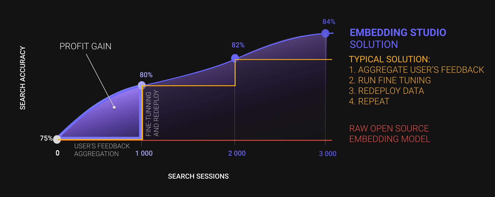

# EmbeddingStudio

[]() 
[](https://www.python.org/downloads/release/python-360/)


EmbeddingStudio is an innovative open-source framework designed to seamlessly convert a combined 
"Embedding Model + Vector DB" into a comprehensive search engine. With built-in functionalities for 
clickstream collection, continuous improvement of search experiences, and automatic adaptation of 
the embedding model, it offers an out-of-the-box solution for a full-cycle search engine.



## Features

1. 🔄 Turn your vector database into a full-cycle search engine
2. 🖱️ Collect users feedback like clickstream
3. 🚀 (*) Improve search experience on-the-fly without frustrating wait times
4. 📊 (*) Monitor your search quality
5. 🎯 Improve your embedding model through an iterative metric fine-tuning procedure
6. 🆕 (*) Use the new version of the embedding model for inference

(*) - features in development

EmbeddingStudio is highly customizable, so you can bring your own:
1. Data source
2. Vector database
3. Clickstream database
4. Embedding model

## Getting Started

### Hello, Unstructured World!

To try out EmbeddingStudio, you can launch the pre-configured demonstration project. We've prepared a dataset stored in
a public S3 bucket, an emulator for user clicks, and a basic script for fine-tuning the model. By adapting it to your
requirements, you can initiate fine-tuning for your model.

Firstly, bring up all the EmbeddingStudio services by executing the following command:

```shell
docker compose up -d 
```

Upon building and starting, the following services will be launched:

1. **embedding_studio**: The primary service accessible at http://localhost:5000, responsible for the core engine 
   functionality.
2. **fine_tuning_worker**: A worker service for model fine-tuning based on user feedback, leveraging NVIDIA GPUs for 
   the task.
3. **mlflow**: A service facilitating the tracking of fine-tuning experiments.
4. **mlflow_db**: A MySQL instance for storing MLflow-related data.
5. **mongo**: A MongoDB service for storing user interactions and tasks for model fine-tuning.
6. **redis**: A Redis service for task storage during fine-tuning.
7. **minio**: A MinIO service set up for artifact storage, ensuring a secure location for your data.

Once all services are up, you can start using EmbeddingStudio. Let's simulate a user search session. We'll run a 
pre-built script that will invoke the EmbeddingStudio API and emulate user behavior:

```shell
docker compose --profile demo_stage_clickstream up -d
```

After the script execution, you can initiate model fine-tuning. Execute the following command:

```shell
docker compose --profile demo_stage_finetuning up -d
```

This will queue a task processed by the fine-tuning worker. To fetch all tasks in the fine-tuning queue, send a GET 
request to the endpoint `/api/v1/fine-tuning/task`:

```shell
curl -X GET http://localhost:5000/api/v1/fine-tuning/task
```

The answer will be something like:
```json
[
   {
      "fine_tuning_method": "Default Fine Tuning Method",
      "status": "processing",
      "created_at": "2023-12-21T14:30:25.823000",
      "updated_at": "2023-12-21T14:32:16.673000",
      "batch_id": "65844a671089823652b83d43",
      "id": "65844c019fa7cf0957d04758"
   }
]
```
where:
* `fine_tuning_method`: The method used for fine-tuning the model. We'll discuss this further later on.
* `status`: The status of the task.
* `created_at`: The task creation date.
* `updated_at`: The last task update date.
* `batch_id`: The batch identifier indicating a completed clickstream session.
* `id`: The task identifier.

Once you have the task ID, you can directly monitor the fine-tuning progress by sending a GET request to the 
endpoint `/api/v1/fine-tuning/task/{task_id}`:

```shell
curl -X GET http://localhost:5000/api/v1/fine-tuning/task/65844c019fa7cf0957d04758
```

The result will be similar to what you received when querying all tasks.

For a more convenient way to track progress, you can use Mlflow at http://localhost:5001. Here, you'll find the
following experiments:

* `Default`: A default experiment generated by Mlflow, which we don't use.
* `iteration / initial`: This experiment stores the model used for training, loaded into Mlflow using the
  `upload_initial_model` method (see [Plugins](#plugins)).
* `iteration / Default Fine Tuning Method / 65844a671089823652b83d43`: This experiment is the result of the fine-tuning
  process. Learn more about Mlflow in
  [their documentation](https://mlflow.org/docs/latest/getting-started/intro-quickstart/index.html#step-6-view-the-run-in-the-mlflow-ui).
  Also, you can find more information about the fine-tuning process in the
  section [About fine-tuning tracking](#about-fine-tuning-tracking)

Fine-tuning is a very long process, so **it can take about 30 minutes (if using a GPU)**.

It's also beneficial to check the logs of the `fine_tuning_worker` to ensure everything is functioning correctly. To do 
this, list all services using the command:

```shell
docker ps
```

You'll see output similar to:
```shell
CONTAINER ID   IMAGE                                 COMMAND                  CREATED       STATUS                 PORTS                               NAMES
665eef2e757d   embedding_studio-mlflow               "mlflow server --bac…"   3 hours ago   Up 3 hours             0.0.0.0:5001->5001/tcp              embedding_studio-mlflow-1
65043da928d4   embedding_studio-fine_tuning_worker   "dramatiq embedding_…"   3 hours ago   Up 3 hours                                                 embedding_studio-fine_tuning_worker-1
c930d9ca07c0   embedding_studio-embedding_studio     "uvicorn embedding_s…"   3 hours ago   Up 3 hours (healthy)   0.0.0.0:5000->5000/tcp              embedding_studio-embedding_studio-1
5e799aaaf17b   redis:6.2-alpine                      "docker-entrypoint.s…"   3 hours ago   Up 3 hours (healthy)   0.0.0.0:6379->6379/tcp              embedding_studio-redis-1
ba608b022828   bitnami/minio:2023                    "/opt/bitnami/script…"   3 hours ago   Up 3 hours (healthy)   0.0.0.0:9000-9001->9000-9001/tcp    embedding_studio-minio-1
914cb70ed622   mysql/mysql-server:5.7.28             "/entrypoint.sh mysq…"   3 hours ago   Up 3 hours (healthy)   0.0.0.0:3306->3306/tcp, 33060/tcp   embedding_studio-mlflow_db-1
493c45f880c0   mongo:4                               "docker-entrypoint.s…"   3 hours ago   Up 3 hours (healthy)   0.0.0.0:27017->27017/tcp            embedding_studio-mongo-1
```

From here, you can access logs for the specific service using its `CONTAINER ID` or `NAME`, e.g., `65043da928d4` or 
`embedding_studio-fine_tuning_worker-1`:

```shell
docker logs embedding_studio-fine_tuning_worker-1
```

If everything completes successfully, you'll see logs similar to:

```shell
Epoch 2: 100%|██████████| 13/13 [01:17<00:00,  0.17it/s, v_num=8]
[2023-12-21 14:59:05,931] [PID 7] [Thread-6] [pytorch_lightning.utilities.rank_zero] [INFO] `Trainer.fit` stopped: `max_epochs=3` reached.
Epoch 2: 100%|██████████| 13/13 [01:17<00:00,  0.17it/s, v_num=8]
[2023-12-21 14:59:05,975] [PID 7] [Thread-6] [embedding_studio.workers.fine_tuning.finetune_embedding_one_param] [INFO] Save model (best only, current quality: 8.426392069685529e-05)
[2023-12-21 14:59:05,975] [PID 7] [Thread-6] [embedding_studio.workers.fine_tuning.experiments.experiments_tracker] [INFO] Save model for 2 / 9a9509bf1ed7407fb61f8d623035278e
[2023-12-21 14:59:06,009] [PID 7] [Thread-6] [embedding_studio.workers.fine_tuning.experiments.experiments_tracker] [WARNING] No finished experiments found with model uploaded, except initial
[2023-12-21 14:59:16,432] [PID 7] [Thread-6] [embedding_studio.workers.fine_tuning.experiments.experiments_tracker] [INFO] Upload is finished
[2023-12-21 14:59:16,433] [PID 7] [Thread-6] [embedding_studio.workers.fine_tuning.finetune_embedding_one_param] [INFO] Saving is finished
[2023-12-21 14:59:16,433] [PID 7] [Thread-6] [embedding_studio.workers.fine_tuning.experiments.experiments_tracker] [INFO] Finish current run 2 / 9a9509bf1ed7407fb61f8d623035278e
[2023-12-21 14:59:16,445] [PID 7] [Thread-6] [embedding_studio.workers.fine_tuning.experiments.experiments_tracker] [INFO] Current run is finished
[2023-12-21 14:59:16,656] [PID 7] [Thread-6] [embedding_studio.workers.fine_tuning.experiments.experiments_tracker] [INFO] Finish current iteration 2
[2023-12-21 14:59:16,673] [PID 7] [Thread-6] [embedding_studio.workers.fine_tuning.experiments.experiments_tracker] [INFO] Current iteration is finished
[2023-12-21 14:59:16,673] [PID 7] [Thread-6] [embedding_studio.workers.fine_tuning.worker] [INFO] Fine tuning of the embedding model was completed successfully!
```

**Congratulations! You've successfully improved the model!**

### Advanced

While we've successfully run the demo project, you'll likely want to run EmbeddingStudio on your own model. For this, 
you'll need to prepare the model, upload it to an S3 storage, and write a script for fine-tuning the model. The steps 
include:
- [Configure Environment](#configure-environment)
- [Prepare Model](#prepare-model)
- [Prepare Fine-Tuning Method](#prepare-fine-tuning-method)
- [Run EmbeddingStudio](#run-embeddingstudio)
- [Clickstream](#clickstream)
- [Fine-Tuning](#fine-tuning)

#### Configure Environment

All necessary environment variables can be found in the `.env` file.

We have following groups of variables:
1. **fine-tuning**: Variables for MongoDB for fine-tuning service.
2. **clickstream**: Variables for MongoDB for clickstream service.
3. **redis**: Variables for Redis.
4. **minio**: Variables for MinIO storage.
5. **mysql**: Variables for MySQL for MLFlow.
6. **mlflow**: Variables for MLFlow.
7. **plugins**: Variables for plugins.
8. **fine-tuning-worker**: Variables for fine-tuning worker.

And a lots of variables for retry and timeout settings.

#### Check your data source

Currently, EmbeddingStudio only supports S3 storage. If your data resides on a different storage system, you'll need to
implement your own [DataLoader](embedding_studio/embeddings/data/loaders/data_loader.py).

Ensure that the machine running the EmbeddingStudio worker has the necessary permissions to read from your S3 storage.
You'll either need to grant read permissions directly or use a separate role with read access.

In your [plugin](#plugins), make sure to specify the following parameters:

* `role_arn`
* `aws_access_key_id`
* `aws_secret_access_key`

If you don't specify these parameters, EmbeddingStudio will use an anonymous session.

For detailed instructions on setting up permissions in S3, refer to
the [AWS documentation]((https://docs.aws.amazon.com/AWSEC2/latest/UserGuide/iam-roles-for-amazon-ec2.html)).

#### Prepare Fine-Tuning Method

This is the main part you'll need to implement yourself. You need to write a script that initiates the fine-tuning of 
the model. This script inherits from the `FineTuningMethod` class and should implement the `upload_initial_model` 
method (used for uploading your model to Mlflow) and the `get_fine_tuning_builder` method (used for configuring the 
model's fine-tuning). An example of such a script can be found in the directory 
[plugins/default_fine_tuning_method.py](plugins/default_fine_tuning_method.py).

You can have multiple fine-tuning scripts. The choice of which script to use occurs when launching the task:

```shell
curl -X POST http://localhost:5000/api/v1/fine-tuning/task \
  -H 'Content-Type: application/json' \
  -d '{
    "fine_tuning_method": "Default Fine Tuning Method"
}'
```
where, `fine_tuning_method` is the name of your fine-tuning script, taken from the `meta.name` field.

The path to the plugins directory is specified in the `ES_PLUGINS_PATH` environment variable. By default, it points to 
the `plugins` directory at the project's root. It's easiest to change this in the `.env` file.

For more details on plugins, see the [Plugins](#plugins) section.

#### Run EmbeddingStudio

After writing your plugin (fine-tuning method), you can start the EmbeddingStudio worker - `fine_tuning_worker`. 
To do this, you need to build an image with your plugin and start the worker. You can do this in two different ways:

1. Rebuild the `fine_tuning_worker` image with your plugin and start it:

```shell
docker compose build --no-cache fine_tuning_worker
```
and
```shell
docker compose up -d fine_tuning_worker
```

It will pick up your plugin and wait for fine-tuning tasks.

2. To avoid rebuilding the image every time, you can mount the `plugins` directory inside the container. To do this, 
   add a `volume` section to the `docker-compose.yml`:

```yaml
services:
  ...
  fine_tuning_worker:
    ...
    volumes:
      - ./plugins:/embedding_studio/plugins
  ...
```

and start the container:
```shell
docker compose up -d fine_tuning_worker
```

All set! It's time to start collecting user clickstreams.

#### Clickstream

A clickstream is a sequence of user search sessions. A search session is a series of user clicks on search results. 
Clickstreams are used to gather user feedback and improve the model based on it.

To start a new session, send a POST request to the `/api/v1/clickstream/session` endpoint:

```shell
curl -X POST http://localhost:5000/api/v1/clickstream/session \
  -H 'Content-Type: application/json' \
  -d '{
    "session_id": "session_id",
    "search_query": "user_1",
    "search_meta": "search_meta_1",
    "search_results": "search_results_1"
}'
```
where:
* `session_id` - session identifier
* `search_query` - user's search query
* `search_meta` - meta-information about the search query
* `search_results` - search results

#### Fine-Tuning

Here's an overview of what to expect during the fine-tuning process:

1. **Initial Model Setup**: The process begins by downloading and locally saving either the initial model or the model
   from the most recent iteration.
2. **Hyperparameter Selection**: Next, subsets of hyperparameters are defined for exploration. These may be initial sets
   or derived from the last iteration.3. Iteration Creation: An iteration is created, referred to as an experiment
   in MLFlow terminology.
3. **Hyperparameter Runs**: For each subset of hyperparameters (termed fine-tuning params in our context), a run is
   initiated.
4. **Executing Fine-Tuning**: The fine-tuning run starts, using the specified hyperparameters.
5. **Model Evaluation and Saving**: After each run, the main metric is evaluated. If the result is the best so far, the
   model is saved, and the previously best model is deleted, if feasible.
6. **Iteration Completion**: Upon completing all runs, the previous iteration is removed from the system.
7. **Model Cleanup**: Finally, the locally saved model is deleted.

Once you've gathered enough data, you can initiate the fine-tuning process. It proceeds similarly to what was 
[described earlier](#hello-world).

## About fine-tuning tracking

If you want to check results: http://localhost:5001/#/experiments/{experiment_id}
Upon accessing the main page of MLFlow, you will notice the initial iteration listed among the experiments, labeled as 
iteration / initial.When you explore a run named initial_model, it will display the artifacts associated with the 
initial model.

### Iteration data

When delving into iteration information, it's important to note that every legitimate iteration follows a specific
naming pattern in the list of experiments on MLFlow. This pattern is iteration / plugin_name / batch_id.
It's crucial to adhere to this naming convention as the service is designed to recognize and process iterations named in
this manner. Any experiments not conforming to this pattern will be disregarded by the service.
When exploring the most recent run in MLFlow, which is typically the first run listed, you will notice that
this run includes an uploaded model. This indicates that the model associated with the latest iteration has been
successfully saved and integrated into the run's artifacts within MLFlow.     
When navigating through MLFlow, you have the option to delve deeper into specific metrics of interest.
By clicking on the name of a particular metric, such as train loss, you can view its detailed plot.This feature allows
you to visually analyze the metric's performance over time, offering insights into the training process
and the effectiveness of the fine-tuning being applied to the model.

### Most important metrics

* train_loss (mean_train_loss, sliding_train_loss)* test_loss
* train_not_irrelevant_dist_shift* the main metric: test_not_irrelevant_dist_shift

About Distance shift metric you read in the following sections

### What do we track

During the fine-tuning process, we compute and monitor various metrics. These metrics need to be communicated to our
Experiments Manager, ensuring it is aware of what to track. This setup is crucial for identifying the most significant
metric. In our case, the main_metric parameter is set to 'test_not_irrelevant_dist_shift',
which guides the manager in determining the best model performances. By configuring the Experiments Manager with these
metrics, we enable it to selectively save only the top-performing models,
based on the key metric specified.

### What is Distance Shift

The DistanceShift metric in the context of clickstream data analysis is a specialized measure used to evaluate
the performance of machine learning models, particularly those involved in embedding and ranking algorithms. This metric
is crucial for understanding how changes in the model (such as during fine-tuning) affect the relevance
and ordering of items within user sessions.

### Purpose of the Distance Shift Metric

* **Evaluating Model Performance**: The distance shift metric helps in assessing how well a model ranks items
  in a clickstream session, especially after adjustments or fine-tuning. It's essential in systems where the order of
  items (like search results or product recommendations) is critical for user satisfaction.

* **Understanding Relevance**: In clickstream analysis, determining the relevance of items to a user’s query or behavior is
  crucial.
  The distance shift metric provides insights into how changes in the model affect this relevance.
* **Model Optimization**: By quantifying the impact of model adjustments, this metric guides developers and data scientists
  in optimizing their models for better performance in real-world scenarios.

## Plugins

EmbeddingStudio supports plugins for fine-tuning models. A plugin is a script that inherits from the 
[`FineTuningMethod`](embedding_studio/core/plugin.py) class and implements the `upload_initial_model` and 
`get_fine_tuning_builder` methods. Plugins can be of any type; you can use any libraries and frameworks for model 
fine-tuning.

The path to the plugins directory is specified in the `ES_PLUGINS_PATH` environment variable. By default, it points 
to the `plugins` directory at the project's root. You can easily change this in the `.env` file.

We provide a demonstration plugin named [`Default Fine Tuning Method`](plugins/default_fine_tuning_method.py).

Let's dive into how it works:

```python
class DefaultFineTuningMethod(FineTuningMethod):
    meta = PluginMeta(
        name="Default Fine Tuning Method",
        version="0.0.1",
        description="A default fine-tuning plugin",
    )
    ...
```
The class name can be arbitrary, but it must inherit from `FineTuningMethod`. In the `meta` field, you specify metadata 
about the plugin. This is used by EmbeddingStudio to determine which plugin to use for fine-tuning. The `meta.name` 
field is essential because it's used to create tasks for `fine_tuning_worker`.

Next, let's look at the `upload_initial_model` method:

```python
def upload_initial_model(self) -> None:
    model = TextToImageCLIPModel(SentenceTransformer("clip-ViT-B-32"))
    self.manager.upload_initial_model(model)
```

In this function, we define the initial model for fine-tuning. In our case, it's the `TextToImageCLIPModel` model 
composed of the `SentenceTransformer` model named `clip-ViT-B-32`. We upload it to Mlflow for future use in fine-tuning. 
The call to `self.manager.upload_initial_model(model)` is mandatory.

Now, let's examine the plugin initialization method. We've tried to describe what each line does in the comments:

```python
def __init__(self):
    # uncomment and pass your credentials to use your own s3 bucket
    # creds = {
    #     "role_arn": "arn:aws:iam::123456789012:role/some_data"
    #     "aws_access_key_id": "TESTACCESSKEIDTEST11",
    #     "aws_secret_access_key": "QWERTY1232qdsadfasfg5349BBdf30ekp23odk03",
    # }
    # self.data_loader = AWSS3DataLoader(**creds)

    # with empty creds, use anonymous session
    creds = {
    }
    self.data_loader = AWSS3DataLoader(**creds)

    self.retriever = TextQueryRetriever()
    self.parser = AWSS3ClickstreamParser(
        TextQueryItem, SearchResult, DummyEventType
    )
    self.splitter = ClickstreamSessionsSplitter()
    self.normalizer = DatasetFieldsNormalizer("item", "item_id")
    self.storage_producer = CLIPItemStorageProducer(self.normalizer)

    self.accumulators = [
        MetricsAccumulator("train_loss", True, True, True, True),
        MetricsAccumulator(
            "train_not_irrelevant_dist_shift", True, True, True, True
        ),
        MetricsAccumulator(
            "train_irrelevant_dist_shift", True, True, True, True
        ),
        MetricsAccumulator("test_loss"),
        MetricsAccumulator("test_not_irrelevant_dist_shift"),
        MetricsAccumulator("test_irrelevant_dist_shift"),
    ]

    self.manager = ExperimentsManager(
        tracking_uri=settings.MLFLOW_TRACKING_URI,
        main_metric="test_not_irrelevant_dist_shift",
        accumulators=self.accumulators,
    )

    self.initial_params = INITIAL_PARAMS
    self.initial_params.update(
        {
            "not_irrelevant_only": [True],
            "negative_downsampling": [
                0.5,
            ],
            "examples_order": [
                [
                    11,
                ]
            ],
        }
    )

    self.settings = FineTuningSettings(
        loss_func=CosineProbMarginRankingLoss(),
        step_size=35,
        test_each_n_sessions=0.5,
        num_epochs=3,
    )
```

Finally, let's look at the `get_fine_tuning_builder` method:

```python
def get_fine_tuning_builder(
    self, clickstream: List[SessionWithEvents]
) -> FineTuningBuilder:
    ranking_dataset = prepare_data(
        clickstream,
        self.parser,
        self.splitter,
        self.retriever,
        self.data_loader,
        self.storage_producer,
    )
    fine_tuning_builder = FineTuningBuilder(
        data_loader=self.data_loader,
        query_retriever=self.retriever,
        clickstream_parser=self.parser,
        clickstream_sessions_splitter=self.splitter,
        dataset_fields_normalizer=self.normalizer,
        item_storage_producer=self.storage_producer,
        accumulators=self.accumulators,
        experiments_manager=self.manager,
        fine_tuning_settings=self.settings,
        initial_params=self.initial_params,
        ranking_data=ranking_dataset,
        initial_max_evals=5,
    )
    return fine_tuning_builder
```

In this method, we describe how the model fine-tuning will take place. In our case, we use the 
[`prepare_data`](embedding_studio/workers/fine_tuning/data/prepare_data.py) function to transform the clickstream into 
a dataset suitable for fine-tuning. Then, we create an instance of the `FineTuningBuilder` class, which will perform 
the fine-tuning. In the constructor, we pass all the necessary components that will be used during the fine-tuning 
process.

## Contributing

We welcome contributions to EmbeddingStudio!

## License

EmbeddingStudio is licensed under the Apache License, Version 2.0. See [LICENSE](LICENSE) for the full license text.