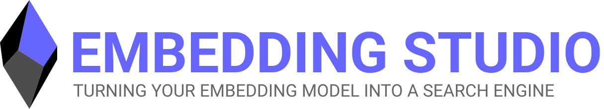
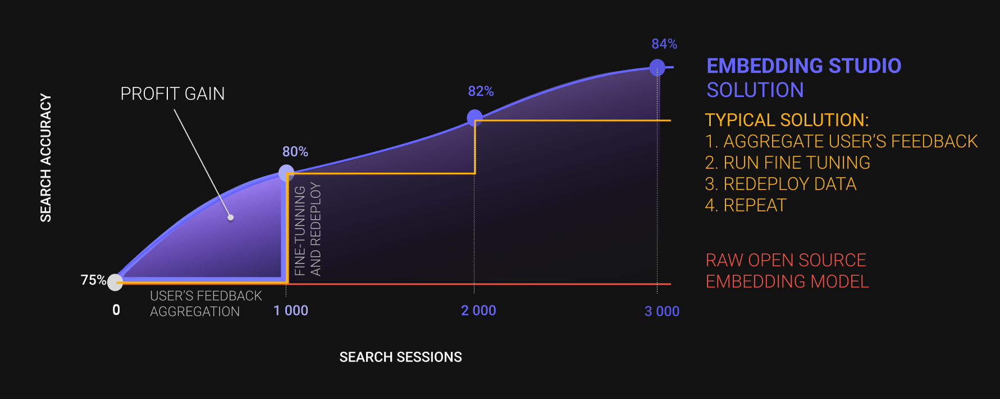

    <a href="https://hugsearch.demo.embeddingstud.io/" style="font-size: 20px;"><strong>👉 Try the Live Demo</strong></a>

    
    
    
    

    <a href="https://embeddingstud.io/">Website</a> •
    <a href="https://embeddingstud.io/tutorial/getting_started/">Documentation</a> •
    <a href="https://embeddingstud.io/challenges/">Challenges & Solutions</a> •
    <a href="https://embeddingstud.io/challenges/">Use Cases</a>

---

    <video height="640" autoplay muted loop playsinline>
      <source src="https://hugsearch.demo.embeddingstud.io/demo.webm" type="video/webm">
      Your browser does not support the video tag.
    </video>

---

**Embedding Studio** is an innovative open-source framework designed to transform embedding models and vector databases into comprehensive, self-improving search engines. With built-in clickstream collection, continuous model refinement, and intelligent vector optimization, it creates a feedback loop that enhances search quality over time based on real user interactions.

---

## Search Quality Evolution

RED: On the graph, typical search solutions without enhancements, 
such as Full Text Searching (FTS), Nearest Neighbor Search (NNS), and others, are marked in red. Without the use of 
additional tools, the search quality remains unchanged over time.

ORANGE: Solutions are depicted that accumulate some feedback (clicks, reviews, votes, discussions, etc.) and then
initiate a full model retraining. The primary issue with these solutions is that full model retraining is a
time-consuming and expensive procedure, thus lacking reactive adjustments (for example, when a product suddenly
experiences increased demand, and the search system has not yet adapted to it).

INDIGO: We propose a solution that allows collecting user feedback and rapidly retraining the model on the difference between
the old and new versions. This enables a smoother and more relevant search quality curve for your system.

---

## Features

### Core Capabilities

- 🔄 **Full-Cycle Search Engine** - Transform your vector database into a complete search solution
- 🖱️ **User Feedback Collection** - Automatically gather clickstream and session data
- 🚀 **Continuous Improvement** - Enhance search quality on-the-fly without long waiting periods
- 📊 **Performance Monitoring** - Track search quality metrics through comprehensive dashboards
- 🎯 **Iterative Fine-Tuning** - Improve your embedding model through user interaction data
- 🔍 **Blue-Green Deployment** - Zero-downtime deployment of improved embedding models
- 💾 **Multi-Source Integration** - Connect to various data sources (S3, GCP, PostgreSQL, etc.)
- 🧠 **Vector Optimization** - Apply post-training adjustments for incremental improvements

### Specialized Features

- 📈 **Personalization Support** - User-specific vector adjustments based on behavior
- 💬 **Suggestion System** - Intelligent query autocompletions from usage patterns
- 🔎 **Category Prediction** - Identify relevant categories from user queries
- 🔤 **Multi-Modal Support** - Work with text, images, and structured data
- 🧩 **Plugin Architecture** - Easily extend functionality

### In Development

- 📑 **Zero-Shot Query Parser**
- 📚 **Catalog Pre-Training**
- 📊 **Advanced Analytics**

---

## When is Embedding Studio the Best Fit?

- 📚💼 **Rich Content Collections** – Extensive catalogs and unstructured data
- 🛍️🤝 **Customer-Centric Platforms** – Personalized UX
- 🔄📊 **Dynamic Content** – Evolving information
- 🔍🧠 **Complex Queries** – Multifaceted search
- 🔄📊 **Mixed Data Types** – Structured + unstructured
- 💵💡 **Cost-Conscious Organizations** – Optimize without high cost

More at: [docs/when-to-use-the-embeddingstudio.md](docs/when-to-use-the-embeddingstudio.md)

---

## How it works

[Follow our tutorial](tutorial/getting_started/introduction) to get acquainted with the main functions.

---

## Challenges Solved

> Embedding Studio is **not a vector DB**. It transforms your vector DB into a full search engine.

- ✅ Cold Start Problems
- ✅ Static Search Quality
- ✅ Long Improvement Cycles
- ✅ Expensive Reindexing
- ✅ Hybrid Search Complexity
- ✅ Query Understanding
- ✅ New Content Discovery

---

## System Architecture

### Core Components

- **API Service** - Main orchestrator
- **Vector DB** - PostgreSQL with pgvector
- **Clickstream System** - Track user interactions
- **Workers**:
  - Fine-Tuning Worker
  - Inference Worker (Triton)
  - Improvement Worker
  - Upsertion Worker

### Data Flow

1. Ingest content
2. Track user behavior
3. Fine-tune on feedback
4. Redeploy improved models
5. Serve better search results

---

## 📬 Contact Us

**EulerSearch Inc.**  
3416, 1007 N Orange St. 4th Floor,  
Wilmington, DE, New Castle, US, 19801  
📧 [aleksandr.iudaev@eulersearch.com](mailto:aleksandr.iudaev@eulersearch.com)  
📞 +34 (691) 454 148  
🔗 [LinkedIn](https://www.linkedin.com/in/alexanderyudaev/)
