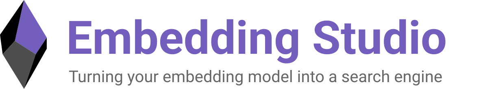

{ .center }

    
    
    
    

    <a href="https://embeddingstud.io/tutorial/hello_unstructured_world/">Tutorial</a> •
    <a href="https://embeddingstud.io/tutorial/getting_started/">Documentation</a> •    
    <a href="https://embeddingstud.io/overview/">Overview</a>

**Embedding Studio** is an innovative open-source framework designed to seamlessly convert a combined
embedding model and vector database into a comprehensive search engine. With built-in functionalities for
clickstream collection, continuous improvement of search experiences, and automatic adaptation of
the embedding model, it offers an out-of-the-box solution for a full-cycle search engine.

Our framework enables you to continuously fine-tune your model based on user experience, allowing you to form search 
results for user queries faster and more accurately.

RED: On the graph, typical search solutions without enhancements, 
such as Full Text Searching (FTS), Nearest Neighbor Search (NNS), and others, are marked in red. Without the use of 
additional tools, the search quality remains unchanged over time.

ORANGE: In yellow, solutions are depicted that accumulate some feedback (clicks, reviews, votes, discussions, etc.) and then
initiate a full model retraining. The primary issue with these solutions is that full model retraining is a
time-consuming and expensive procedure, thus lacking reactive adjustments (for example, when a product suddenly
experiences increased demand, and the search system has not yet adapted to it).

INDIGO: We propose a solution that allows collecting user feedback and rapidly retraining the model on the difference between
the old and new versions. This enables a smoother and more relevant search quality curve for your system.

## Features

* :octicons-search-16:{ .es-color } Turn your vector database into a full-cycle search engine
* :material-cursor-default-click:{ .es-color } Collect users feedback like clickstream
* :octicons-rocket-16:{ .es-color } (*) Improve search experience on-the-fly without frustrating wait times
* :simple-grafana:{ .es-color } (*) Monitor your search quality
* :material-tune:{ .es-color } Improve your embedding model through an iterative metric fine-tuning procedure
* :material-new-box:{ .es-color } (*) Use the new version of the embedding model for inference

(*) - features in development

Embedding Studio is highly customizable, so you can bring your own:

* :simple-googlecloudstorage:{ .es-color } Data source
* :material-database:{ .es-color } Vector database
* :material-cursor-default-click:{ .es-color } Clickstream database
* :simple-databricks:{ .es-color } Embedding model

## How it works

[Follow our tutorial](tutorial/getting_started.md) to get acquainted with the main functions.
