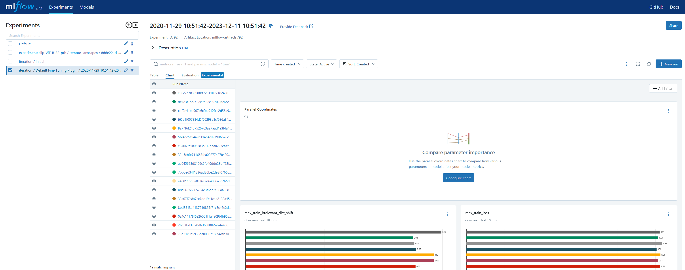
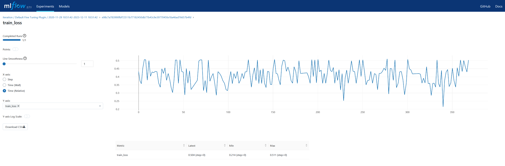

# Fine-tuning tracking

If you would like to track your progress, you can use `MLflow` at `http://localhost:5001`. Here, you'll find the
following experiments:

* `Default`: A default experiment generated by MLflow, which we don't use.
* `iteration / initial`: This experiment stores the model used for training, loaded into MLflow using the
  `upload_initial_model` method (see [Plugins](plugins.md)).
* `iteration / Default Fine Tuning Method / 65844a671089823652b83d43`: This experiment is the result of the fine-tuning
  process. Learn more about MLflow in
  [their documentation](https://mlflow.org/docs/latest/getting-started/intro-quickstart/index.html#step-6-view-the-run-in-the-mlflow-ui).

Upon accessing the main page of `MLflow`, you will notice the initial iteration listed among the experiments, labeled as
`iteration / initial`. When you explore a run named `initial_model`, it will display the artifacts associated with the
initial model.

## Iteration data

When delving into iteration information, it's important to note that every legitimate iteration follows a specific
naming pattern in the list of experiments on `MLflow`. This pattern is `iteration / plugin_name / batch_id`.
It's crucial to adhere to this naming convention as the service is designed to recognize and process iterations named in
this manner. Any experiments not conforming to this pattern will be disregarded by the service.

When exploring the most recent run in `MLflow`, which is typically the first run listed, you will notice that
this run includes an uploaded model. This indicates that the model associated with the latest iteration has been
successfully saved and integrated into the run's artifacts within `MLflow`.

When navigating through `MLflow`, you have the option to delve deeper into specific metrics of interest.
By clicking on the name of a particular metric, such as `train loss`, you can view its detailed plot.This feature allows
you to visually analyze the metric's performance over time, offering insights into the training process
and the effectiveness of the fine-tuning being applied to the model.

## Most important metrics

The most important metrics:

* train_loss (mean_train_loss, sliding_train_loss)* test_loss
* train_not_irrelevant_dist_shift* the main metric: test_not_irrelevant_dist_shift

About Distance shift metric you read in the following sections.

## What do we track

During the fine-tuning process, we compute and monitor various metrics. These metrics need to be communicated to our
Experiments Manager, ensuring it is aware of what to track. This setup is crucial for identifying the most significant
metric. In our case, the main_metric parameter is set to `test_not_irrelevant_dist_shift`,
which guides the manager in determining the best model performances. By configuring the Experiments Manager with these
metrics, we enable it to selectively save only the top-performing models,
based on the key metric specified.

## What is Distance Shift

The DistanceShift metric in the context of clickstream data analysis is a specialized measure used to evaluate
the performance of machine learning models, particularly those involved in embedding and ranking algorithms. This metric
is crucial for understanding how changes in the model (such as during fine-tuning) affect the relevance
and ordering of items within user sessions.

### Purpose of the Distance Shift Metric

* **Evaluating Model Performance**: The distance shift metric helps in assessing how well a model ranks items
  in a clickstream session, especially after adjustments or fine-tuning. It's essential in systems where the order of
  items (like search results or product recommendations) is critical for user satisfaction.

* **Understanding Relevance**: In clickstream analysis, determining the relevance of items to a user’s query or behavior
  is
  crucial.
  The distance shift metric provides insights into how changes in the model affect this relevance.
* **Model Optimization**: By quantifying the impact of model adjustments, this metric guides developers and data
  scientists
  in optimizing their models for better performance in real-world scenarios.
